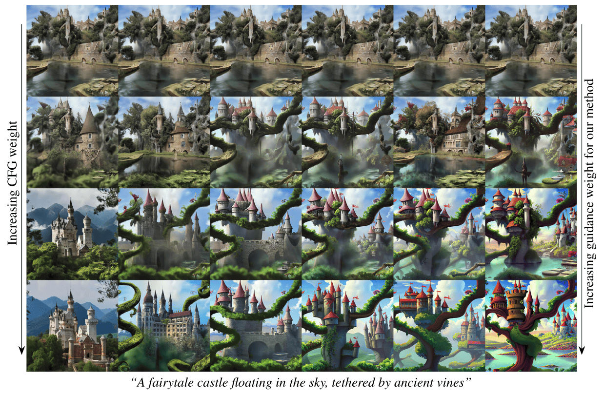

# Guiding a Diffusion Model with a Bad Version of Itself

**Author:** Sushmita Paul  
**Date:** 3/01/2025

So, you know about image generation, right? Well, this is the domain of **Generative Models** which can do magical things like creating images from just from your thoughts. Who wouldn't be happy if they could just imagine a beautiful landscape and see it right in front of their eyes?

  
   
  <em>Figure 1: Dream into Reality</em>

But, as with all things, there are challenges. One of the biggest challenges in generative modeling is to create models that can generate high-quality images with a lot of variety.

Buckle up fellow dreamers, because I am going to take you through a paper that addresses this very challenge. The paper is titled **"Guiding a Diffusion Model with a Bad Version of Itself"** by NVIDIA. Let's dive in!

## The Problem

Currently, the image generation community faces a dilemma: how to balance image **quality** and **variation**. At present, the most popular technique to guide image generation is **Classifier-Free Guidance (CFG)**. This technique uses an unconditional model to guide a conditional one, thereby enhancing prompt alignment and image quality but comes at the cost of reduced variation.

  
   
  <em>Figure 2: Example results for the Tree frog, Palace, Mushroom, Castle</em>

So, they focused on developing a new technique called **Autoguidance** which adresses problems regarding-
1. **Image Quality:** How realistic is the output?  
2. **Variation:** How diverse are the generated results?  
3. **Conditioning Alignment:** How well do the outputs adhere to user-specified prompts or labels?  

Good News! 🎉 The researchers at NVIDIA discovered that high-quality image generation without sacrificing variation is possible (See _Figure 2_). This breakthrough offers disentangled control over image quality and variation, making it a game-changer in image generation.

## Theories

### Diffusion Modeling

It creates samples from a data distribution $p_{\text{data}}(x)$ by iteratively reversing the noise corruption process. To achieve this, one simulates the solution to a stochastic differential equation (SDE) or its deterministic variant—an ordinary differential equation (ODE).

### Forward Process (**NOISE-UP**)

In the forward process, one iteratively adds noise to a data sample $x_0$, such that a sequence of increasingly noisy samples $x_t$ are created:

$$
\begin{equation}
p(x; \sigma) = p_{\text{data}}(x) * N(x; 0, \sigma^2 I)
\end{equation}
$$

The equation  describes smoothing a data distribution by convolving it with a Gaussian, which for large $( \sigma )$ approximates white noise, allowing easy sampling from a normal distribution.

### Reverse Process (**NOISE-DOWN**)

The reverse process removes noise step by step to recover $x_0$. This is formalized as:

$$
\begin{equation}
dx_\sigma = -\sigma \nabla_{x_\sigma} \log p(x_\sigma ; \sigma) d\sigma
\end{equation}
$$ 

The equation describes a probability flow ODE that evolves a sample from high to low noise levels, maintaining the distribution $p(x_\sigma ; \sigma)$ and ultimately recovering the original data distribution $p_{\text{data}}(x_0)$ when $( \sigma = 0 )$.

The ODE is solved numerically by stepping along the trajectory defined by Eq. (1), requiring the evaluation of the score function $\nabla_x \log p(x; \sigma)$ for a given sample $x$ and noise level $\sigma$. This can be approximated using a neural network $D_\theta (x; \sigma)$ trained for denoising:

$$ \theta = \arg \min_\theta \mathbb{E}{y \sim p{\text{data}}, \sigma \sim p_{\text{train}}, n \sim N(0, \sigma^2 I)} |D_\theta (y + n; \sigma) - y |_2^2 $$

where $p_{\text{train}}$ controls the noise level distribution during training with score function is estimated as:

$$
\begin{equation}
\nabla_x \log p(x; \sigma) \approx \frac{D_\theta (x; \sigma) - x}{\sigma^2}.
\end{equation}
$$

Each data sample $x$ is associated with a label $c$. At generation time, we control the outcome by choosing $c$ and seeking a sample from $p(x|c; \sigma)$ with $\sigma = 0$, achieved by training $D_\theta (x; \sigma, c)$ with $c$ as an additional input.

## Why Autoguidance Works ??

> **`Autoguidance:`** The paper suggested the isolation of image-quality improvement effect by training a high quality model (D1) with a poor model (D0) which is trained on the same data but with less capacity or training time. 

### 🎯 **Why This Works**  
Imagine two dart players:  
- **Strong Player (D1) aka HQ-MODEL:** Skilled but struggles with tricky spots (low-probability regions).  
- **Weaker Player (D0) aka LQ-MODEL:** Less skilled but highlights areas where D1 might also fail.  

When they both miss in the same areas, it shows where the Strong Player (model) needs improvement. The Weaker Player’s mistakes guide the Strong Player toward better aim by identifying and reducing errors.  

### 💡 **Key Idea**  
- **Flaws Match:** Both models make compatible mistakes (only the LQ-MODEL makes these mistakes in the same regions, only stronger), so their comparison is meaningful.  
- **Controlled Gap:** The Weaker Player shouldn’t be too random; the skill gap must help focus on real issues.

### **Moral of the Story**  
Using this **mentor-student approach**, the weaker model (D0) amplifies flaws, helping the stronger one (D1) learn and improve accuracy—like refining your aim for the bullseye! 🎯

## Results and Impact

The authors evaluate autoguidance on the **ImageNet** dataset, achieving state-of-the-art FID scores:

- **1.25** for ImageNet-512 (512×512 resolution)  
- **1.01** for ImageNet-64 (64×64 resolution)  

### Quantitative Results

Autoguidance surpasses the current state-of-the-art in both CFG and interval-based guidance techniques. The paper highlights:

- **47% FID improvement** on ImageNet-512 compared to CFG.  
- Preservation or even improvement in variation while increasing the quality of the images.

### Qualitative Results

Autoguidance gives more diverse and realistic outputs. Consider the following examples:

- In the **Palace** class (see Fig. 2), CFG simplifies compositions into canonical templates, whereas autoguidance preserves rich, atypical details (<i>Guiding the results towards clearer realizations as the
guidance weight increases</i>).  
- In complex scenes, autoguidance focuses on enhancing individual elements without sacrificing overall diversity.

### Limitations

A separate model for guiding, but the additional price is meager. For instance, using the EDM2-S/XS pair increases training time by only 3.6%, making it a good bargain.

## Personal Insights and Future Directions

### 🤔 My Thoughts

Autoguidance marks a significant change in the world of generative modeling. This technique cleverly employs a "lesser version" of the model to address the ongoing challenge of achieving a balance between quality and diversity. Not only is this method effective, but it also presents a fascinating philosophical angle—**using flaws as a pathway to improvement.**

### Possible Applications

1. **Image Generation:** Boosting the quality and variety of images produced for different uses, including artistic endeavors, marketing, and content creation.

2. **Text-to-Image Synthesis:** Enhancing the correspondence between images and their textual descriptions, making it valuable for creative writing, storytelling, and visual content development.

3. **Video Generation:** Applying autoguidance techniques to video creation, enabling the production of high-quality videos from random noise or lower-quality sources.

4. **Societal Impact:** Generative modeling opens exciting creative possibilities, producing lifelike images and videos. Yet, its potential for misuse, like spreading disinformation or reinforcing biases, calls for thoughtful and responsible innovation.

### Future Research

1. **Theoretical Guarantees:**  
   Formulate theoretical results on when exactly autoguidance improves over CFG.

2. **Optimized Guiding Models:**  
   Investigate architectural or training optimizations that better align $D_1$ and $D_0$.

3. **Cross-Domain Applications:**  
   Extend autoguidance principles into text, video, and 3D generative models.

## Conclusion

This work, "Guiding a Diffusion Model with a Bad Version of Itself," exemplifies the ingenuity of researchers working on the key problems of generative modeling. These methods will surely be the basis for new developments in diffusion modeling.

## Some More Examples from the Paper

   
    
   
    
   

## References

1. **NVIDIA.** "Guiding a Diffusion Model with a Bad Version of Itself." NeurIPS 2024. [Paper Link](https://openreview.net/forum?id=bg6fVPVs3s)
2. **AI Image Generation Picture** from [Medium](https://medium.com/@natiberk/the-state-of-ai-image-generation-03-24-e91f6d7ea6cf)
3. **Example Images** from the paper by NVIDIA.
3. **Detailed Implementation** of the paper on [GitHub](https://github.com/NVlabs/edm2.git)
